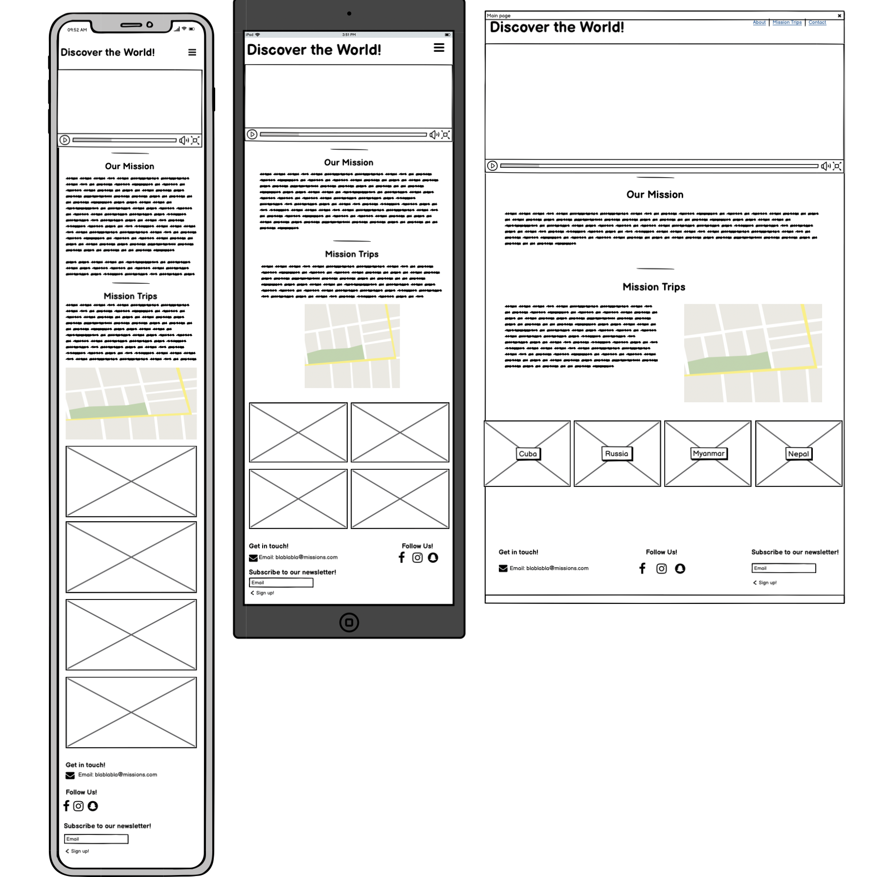
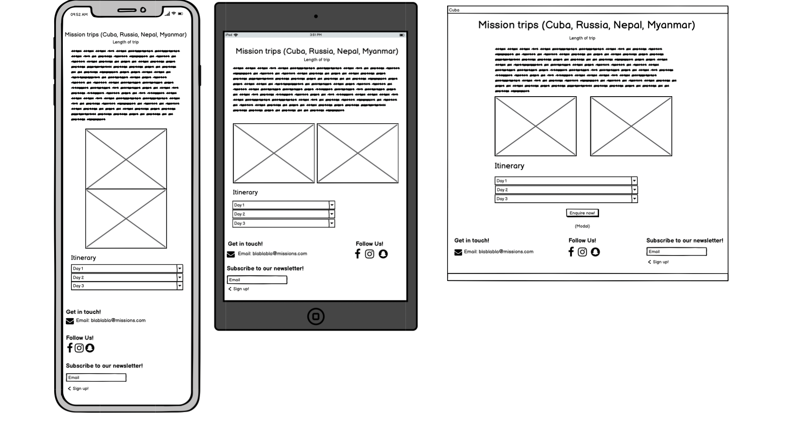
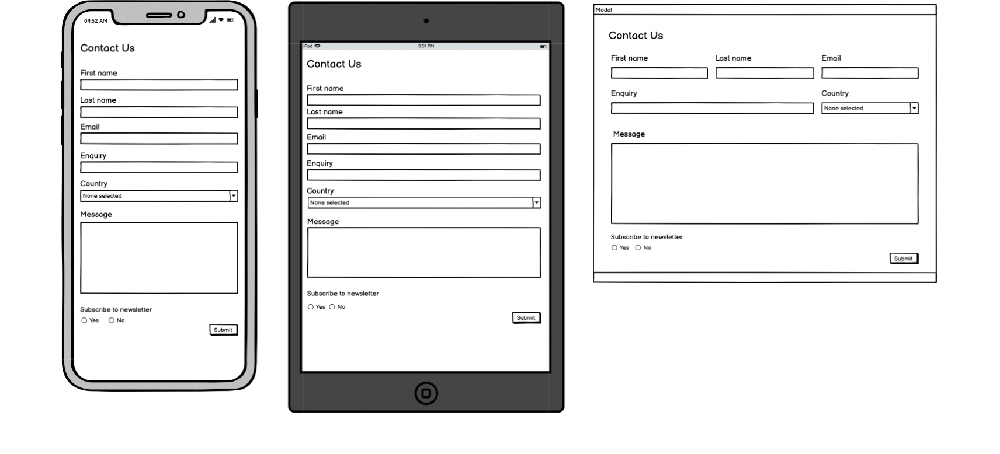
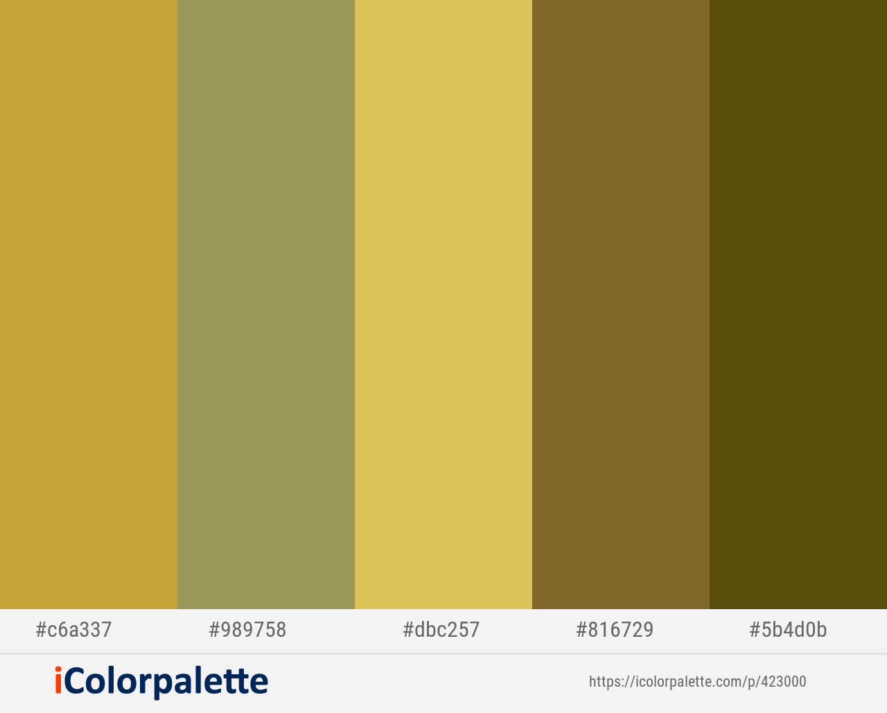

# MOVEMENT

It's part of our human nature to want to explore the world that we live in. Most people go on holiday abroad at least once a year. 
Those who are single or retired travel even more. That is no different for us christians. Most christians have at some point in their 
life wanted to go on a mission trip. Some people want to just experience the life of a missionary as a one off thing and see the work of 
somebody they are either supporting or have heard about, others want to try it out and see if the missionary lifestyle is for them or not 
and if it's something that God has called them to do. 

In this project I've created a website that provides services like this, where individuals/couples/families can experience life in the 
mission field all from a couple of days to a couple of weeks. 

## UX

The website offers different kinds of mission trips depending on what the individual/couple/family is looking for as well as for how long 
they want to go for. There are four different destinations being offered with different trip lengths as well as different types of trips. 
This website targets everyone from creative people who want to use dance and drama as a missions platform; youth groups looking to do work
with other youths or young children, and those who are interested in going around preaching and giving testimonies in different churches.

### Website Goals 

- To gain an increase in website user activity, online enquiries and direct contact with the company

- To provide an easy navigational website for all kinds of users, that is clear and looks professional 

- Establish an online presence with the goal being one of the first options that comes up in the browser search

### User Stories

#### Navbar

- As a user, when logo is clicked, I am redirected to the video with the banner. 

- As a user, when I click the menu links in the Navbar, I will be redirected to another section in the page.

- As a user, when I click the "Contact" page, a popup modal form will appear allowing me to still remain on the site.

#### Main sections

- As a user, when the map markers are clicked I see an overview of the country.

- As a user, when I click the images on the bottom, another window opens up showing me that particular page while still allowing me to
see and access the page I was on.

- As a user, when the accordion is clicked I will see an overview of what is going to happen for each day of the trip.

#### Footer

- As a user, when I click on the email link in the footer, a popup-modal appears with the contact form.

- As a user, when I click on the social links, another window opens up with that particular page allowing me to still see the page I
was on.

- As a user, when email or content in contact form is left blank, an error message appears.

- As a user, when the subscribe field is clicked an error message will appear until a valid email is written. When a valid email has 
been written, button will appear saying Subscribe. After clicking button, field will be empty and button will change color and show 
subscribed.

- As a user, when the itinerary buttons are clicked, the menu will dropdown. When clicked again the button will collapse.

### Wireframes
These are the wireframes that I used in this project. This was the initial draft, but the outcome of the website have a few differences.

## Features

### Existing Features

- Navbar: navigational bar that allows for an easier use of the website by having a logo and menu with content linked to them. Menu collapses
into a hamburger when in ipad or mobile view.

- Jumbotron: gives users an idea of what the website is about in an instance.

- Bacgroundvideo: gives users a visual invitation to join on an exciting journey.

- Map feature: map of the world with markers showing where the trips are located.
    - Markers on the map show an overview of the country when clicked.

- Images: clickable images that will open up in a new page when clicked so that the user can still easily go back to the previous page they were on.

- Contact Popup Modal: modal that pops up with a contact form when clicked on buttons located in different areas of the website. 

- Social links: user can easily follow what is happening by visiting the different links.

- Subscription service: allows users to subscribe quick and easy by filling in their email and clicking button.

- Accordion/Collapse feature: collapse feature that allows the user to see an overview of the itinerary for the trip without too much space being taken
up.

- Carousel feature: showing slideshow with images from the different countries.

### Features Left to Implement

- Features left to implement are maps to the destination pages with markers to show some of the things to do in free time. 

## Technologies Used

1. <a href="https://balsamiq.com">Balsamiq Wireframes</a>
    - used at the beginning of the project to develop the right UX design desired for mobile, iPad and desktop resolutions.

2. <a href="https://html.com/">HTML</a>
    - used to modify and add structure from bootstrap.

3. <a href="https://www.w3.org/Style/CSS/">CSS</a>
    - used to style the website according to its purpose.

4. <a href="https://getbootstrap.com/">Bootstrap v.4.5.2</a>
    - used to build the main frame and structure for all pages with a mobile first approach and desktop view.

5. <a href="https://developer.mozilla.org/en-US/docs/Web/JavaScript">JavaScript</a>
    - used to add the command codes for contact form and subscription service, as well as the map feature. 

6. <a href="https://cloud.google.com/maps-platform">Google Maps Platform</a>
    - used to get API for the map feature, allowing it to be interactive with the user. 

7. <a href="https://fontawesome.com/">Fontawesome</a>
    - used for all the icons.

8. <a href="https://fonts.google.com/">Googlefonts</a>
    - used for the fonts of all pages.

9. <a href="https://github.com/">GitHub</a>
    - I uploaded my projects on a regular basis on github and also used it as a source of information and tool to learn even how to write this ReadMe.

10. <a href="https://google.com">Google</a> and <a href="https://youtube.com">Youtube</a> 
    - used when I was stuck and needed some help in developing my project.

11. <a href="https://icolorpalette.com/">iColor Palette</a>
    - I made use of iColor to find a good color scheme for the website that would suit it's purpose. The palettes I chose to work from can be found below:

    

12. <a href="https://courses.codeinstitute.net/program/FullstackWebDeveloper">Code Institute Course Content</a> 
    - this was a primary source of learning code.

13. <a href="https://developers.google.com/web/tools/chrome-devtools">ChromeDevTools</a>  
    - used frequently to detect any issues/bugs or layout differences.

14. <a href="https://stackoverflow.com/">StackOverFlow</a>  
    - used as a general resource for layout tips or questions.

15. <a href="http://ami.responsivedesign.is/">AmIResponsive</a>  
     - used to check how the layout of the website looks across different devices- found at the top of this README.

## Testing

1. HTML validator
    - I tested the validation of my HTML with an HTML validator and recieved 1 parse error from one of my links located in the head section. I managed to fix this error by replacing "style" with "type".

## Deployment

## Credits

### Content

- The markers on the map were implemented with the help of Traversy Media <a href="https://www.youtube.com/watch?v=Zxf1mnP5zcw&t=577s">Google Maps JavaScript API Tutorial</a>.

- The accordion on the destination pages were implemented with the help from <a href="https://www.youtube.com/watch?v=t5pJ-SYCZa0">Easy Tutorials</a>.

### Media

- The background video on the main page was implemented with the help from CodeNewbies <a href="https://www.youtube.com/watch?v=-G37aahAYlM">tutorial</a>.

- The images and video from the different pages were found from <a href="https://pixabay.com/">Pixabay</a> and <a href="https://pexels.com/">Pexels</a> and are free for commercial use.

### Acknowledgements

- At the start of this project I researched mission websites as well as holiday destination websites to gain some inspiration for the layout
I would want as well as what type of content I should implement. Most of my inspiration came from <a href="https://www.cru.org/">CRU</a> 
and <a href="https://www.exotravel.com/">EXO Travel</a>. 

- I would like to thank my mentor Nishant Kumar for all the help and advice he's given me throughout this project. 

- I would also like to thank my husband for all the support he's given me in taking care of the kids while I have had to code as well as giving me tips and ideas on this project. 

